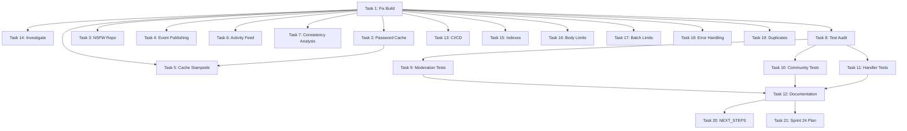

# Sprint 24: Comprehensive Codebase Audit & Critical Fixes

> **Priority**: P0 CRITICAL
> **Duration**: 2 weeks (10 working days)
> **Status**: PLANNED
> **Date**: 2026-02-05
> **Goal**: Production readiness validation and critical issue remediation

---

## Executive Summary

This sprint addresses critical issues identified in the 2026-02-03 audit and establishes production-grade quality standards across the codebase. The focus is fixing blocking issues, improving test coverage from 65% to 80%+, and ensuring cross-artifact consistency.

### Critical Context

**Current Blockers**:
- Build failure in cmd/api/main.go (undefined: gallery)
- 5 critical audit issues requiring immediate attention
- Test coverage at 65% (target: 80%+)
- CI/CD pipeline failures
- Incomplete NSFW repository implementation

**Impact**: These issues prevent production deployment and create technical debt that will compound if not addressed.

---

## Sprint Objectives

| Objective | Current | Target | Success Metric |
|-----------|---------|--------|----------------|
| Fix critical bugs | 5 open | 0 open | All P0 issues resolved |
| Test coverage | 65% | 80%+ | make test-coverage ≥ 80% |
| Build health | FAILING | PASSING | make test passes |
| CI reliability | FAILING | 100% | 3 consecutive green runs |
| Documentation | 91% | 100% | All docs current |
| Code consistency | Unknown | 80+ | brahma-analyzer score |

---

## Task Breakdown by Priority

### P0: Critical (Blocking) - Week 1, Days 1-3

| # | Task | Agent | Effort | Dependencies |
|---|------|-------|--------|--------------|
| 1 | Fix build failure in cmd/api/main.go | senior-go-architect | 2h | None |
| 14 | Investigate and document build/test failures | brahma-investigator | 4h | Task 1 |
| 2 | Fix InMemoryPasswordCache race condition | senior-go-architect | 4h | Task 1 |
| 3 | Implement NSFW repository or disable feature | senior-go-architect | 6h | Task 1 |
| 4 | Fix event publishing error handling | senior-go-architect | 3h | Task 1 |
| 5 | Add cache stampede protection | senior-go-architect | 4h | Task 2 |
| 6 | Cap activity feed LATERAL JOIN limit | senior-go-architect | 3h | Task 1 |

**Total P0 Effort**: 26 hours (3.25 days)

### P1: High Priority - Week 1-2, Days 3-10

| # | Task | Agent | Effort | Dependencies |
|---|------|-------|--------|--------------|
| 7 | Run cross-artifact consistency analysis | brahma-analyzer | 6h | Task 1 |
| 8 | Audit and fix test suite quality issues | backend-test-architect | 16h | Task 1 |
| 9 | Add moderation application tests | backend-test-architect | 16h | Task 8 |
| 10 | Add community application tests | backend-test-architect | 24h | Task 8 |
| 11 | Add HTTP handler tests | backend-test-architect | 16h | Task 8 |
| 12 | Review and update documentation | senior-docs-writer | 12h | Tasks 1-11 |
| 13 | Validate CI/CD pipeline health | cicd-guardian | 8h | Task 1 |

**Total P1 Effort**: 98 hours (12.25 days)

### P2: Medium Priority - Week 2, As Time Permits

| # | Task | Agent | Effort | Dependencies |
|---|------|-------|--------|--------------|
| 15 | Add performance indexes | senior-go-architect | 4h | Task 1 |
| 16 | Add request body size limits middleware | senior-go-architect | 3h | Task 1 |
| 17 | Add batch operation safety limits | senior-go-architect | 3h | Task 1 |
| 18 | Fix untyped errors | senior-go-architect | 4h | Task 1 |
| 20 | Update NEXT_STEPS.md | senior-docs-writer | 2h | Task 12 |
| 21 | Create Sprint 24 plan document | senior-docs-writer | 2h | Task 12 |

**Total P2 Effort**: 18 hours (2.25 days)

### P3: Low Priority - Deferred if Needed

| # | Task | Agent | Effort | Dependencies |
|---|------|-------|--------|--------------|
| 19 | Remove duplicate helper functions | senior-go-architect | 1h | Task 1 |

**Total P3 Effort**: 1 hour

---

## Agent Assignments & Responsibilities

### senior-go-architect (Primary: Code Quality)
**Tasks**: 1, 2, 3, 4, 5, 6, 15, 16, 17, 18, 19
**Total Effort**: 37 hours (4.6 days)

**Responsibilities**:
- Fix all critical code issues (race conditions, memory leaks, unbounded queries)
- Implement missing infrastructure (NSFW repository, cache stampede protection)
- Add performance optimizations (indexes, limits, middleware)
- Code quality improvements (error handling, duplicate removal)

**Acceptance Criteria**:
- All builds pass (make test)
- Race detector passes (go test -race)
- golangci-lint passes with zero errors
- All critical audit issues resolved

### backend-test-architect (Primary: Test Quality)
**Tasks**: 8, 9, 10, 11
**Total Effort**: 72 hours (9 days)

**Responsibilities**:
- Fix test suite quality issues (mocks, flaky tests)
- Add application layer tests (moderation, community, notification, activity)
- Add HTTP handler tests (12 handlers)
- Achieve 80%+ test coverage

**Deliverables**:
- 30+ new test files
- 200+ new test cases
- Coverage reports showing ≥ 80%
- Zero flaky tests

### brahma-analyzer (Primary: Consistency Analysis)
**Tasks**: 7
**Total Effort**: 6 hours (0.75 days)

**Responsibilities**:
- Run cross-artifact consistency analysis
- Check DDD layering compliance
- Validate API spec vs handlers
- Verify database schema vs queries
- Score consistency (target 80+)

**Deliverables**:
- Consistency analysis report
- Violation list with priorities
- Remediation recommendations

### brahma-investigator (Primary: Root Cause Analysis)
**Tasks**: 14
**Total Effort**: 4 hours (0.5 days)

**Responsibilities**:
- Systematic debugging of build failures
- Document all failure root causes
- Create remediation procedures
- Apply 3-retry think protocol for complex issues

**Deliverables**:
- Root cause analysis report
- Troubleshooting guide updates
- Preventive measure recommendations

### senior-docs-writer (Primary: Documentation)
**Tasks**: 12, 20, 21
**Total Effort**: 16 hours (2 days)

**Responsibilities**:
- Review and update all documentation
- Update sprint plans and roadmaps
- Split NEXT_STEPS.md into current + archive
- Create Sprint 24 plan document
- Ensure 100% documentation accuracy

**Deliverables**:
- 20+ documentation files updated
- Sprint 24 plan complete
- Archive structure created
- All docs reflect current state

### cicd-guardian (Primary: CI/CD Health)
**Tasks**: 13
**Total Effort**: 8 hours (1 day)

**Responsibilities**:
- Audit CI/CD pipeline health
- Fix failing workflows
- Optimize CI execution time
- Ensure 100% reliability

**Deliverables**:
- All workflows green (3 runs)
- CI execution time < 10 minutes
- Security scanning passes
- CI troubleshooting documentation

---

## Detailed Task Dependencies



---

## Week-by-Week Execution Plan

### Week 1: Critical Fixes & Foundation

#### Day 1 (P0 Blockers)
- **Morning**: Task 1 (Fix build failure) - senior-go-architect
- **Afternoon**: Task 14 (Investigate failures) - brahma-investigator
- **Evening**: Task 2 (Password cache) - senior-go-architect

**Goal**: Get builds passing, tests compiling

#### Day 2 (P0 Infrastructure)
- **Morning**: Task 3 (NSFW repository) - senior-go-architect
- **Afternoon**: Task 4 (Event publishing) - senior-go-architect
- **Evening**: Task 6 (Activity feed) - senior-go-architect

**Goal**: Fix all critical audit issues

#### Day 3 (P0 Performance)
- **Morning**: Task 5 (Cache stampede) - senior-go-architect
- **Afternoon**: Task 7 (Consistency analysis) - brahma-analyzer
- **Evening**: Task 13 (CI/CD) - cicd-guardian

**Goal**: Production-grade reliability

#### Day 4-5 (P1 Test Suite)
- Task 8 (Test audit) - backend-test-architect
- Task 9 (Moderation tests) - backend-test-architect

**Goal**: Fix test quality issues, start moderation tests

### Week 2: Test Coverage & Documentation

#### Day 6-8 (P1 Test Coverage)
- Task 10 (Community tests) - backend-test-architect
- Task 11 (Handler tests) - backend-test-architect

**Goal**: Achieve 80%+ coverage

#### Day 9 (P1 Documentation)
- Task 12 (Documentation review) - senior-docs-writer
- Task 20 (NEXT_STEPS update) - senior-docs-writer

**Goal**: 100% documentation accuracy

#### Day 10 (P2 Polish + P3 Cleanup)
- Tasks 15-19 (Performance, security, cleanup) - senior-go-architect
- Task 21 (Sprint 24 plan) - senior-docs-writer

**Goal**: Production polish

---

## Quality Gates

### Gate 1: Build Health (End of Day 1)
- ✅ `make test` passes without compilation errors
- ✅ All packages compile
- ✅ No undefined references
- ✅ Import paths correct

**Blocker**: Cannot proceed to Day 2 without passing Gate 1

### Gate 2: Critical Fixes (End of Day 3)
- ✅ All 5 critical audit issues resolved
- ✅ Race detector passes (go test -race)
- ✅ No memory leaks in critical paths
- ✅ Performance queries optimized

**Blocker**: Cannot proceed to test coverage without stable codebase

### Gate 3: Test Coverage (End of Day 8)
- ✅ Overall coverage ≥ 80%
- ✅ Domain coverage ≥ 90%
- ✅ Application coverage ≥ 85%
- ✅ Handler coverage ≥ 75%
- ✅ Zero flaky tests

**Blocker**: Cannot proceed to documentation without test validation

### Gate 4: CI/CD Health (End of Day 9)
- ✅ All GitHub Actions workflows green
- ✅ 3 consecutive successful runs
- ✅ Security scanning 100% pass
- ✅ E2E tests pass
- ✅ OpenAPI validation passes

**Blocker**: Cannot merge without CI reliability

### Gate 5: Documentation (End of Day 10)
- ✅ All documentation files current
- ✅ Sprint plans updated
- ✅ API docs match spec
- ✅ Security gates documented
- ✅ No outdated references

**Final Gate**: Sprint complete

---

## Success Metrics

### Code Quality
- **Builds**: 100% success rate (make test)
- **Race Detector**: 0 race conditions
- **Linter**: 0 errors (golangci-lint)
- **Cyclomatic Complexity**: ≤ 15 per function
- **Code Duplication**: < 3%

### Test Quality
- **Coverage**: 80%+ overall, 90%+ domain, 85%+ application
- **Test Count**: 200+ new tests added
- **Flaky Tests**: 0 (3 runs, 100% pass rate)
- **Test Execution**: < 5 minutes total
- **Test Reliability**: 100% (no intermittent failures)

### Performance
- **Query Performance**: All queries < 100ms p95
- **API Response**: < 200ms p95
- **Memory**: No leaks, bounded cache sizes
- **Database**: Proper indexes, no full table scans

### Security
- **Audit Issues**: 5 critical → 0 critical
- **Security Scan**: 100% pass (gosec, trivy, gitleaks)
- **OWASP Compliance**: Top 10 mitigated
- **Rate Limiting**: All endpoints protected
- **Input Validation**: All handlers validated

### Documentation
- **Completeness**: 100% (no missing docs)
- **Accuracy**: 100% (no outdated info)
- **Coverage**: All features documented
- **API Docs**: Match OpenAPI spec
- **Sprint Plans**: All current

### CI/CD
- **Reliability**: 100% (3 consecutive runs)
- **Execution Time**: < 10 minutes
- **Security Scanning**: 100% pass
- **Caching**: 30%+ time reduction
- **Artifacts**: Properly uploaded

---

## Risk Management

### High Risk: Build Failure Complexity
**Risk**: Build failure may have cascading dependencies
**Mitigation**: Task 14 investigates root cause before fixes
**Contingency**: If > 4h, escalate to team discussion

### Medium Risk: Test Coverage Time
**Risk**: 200+ tests may exceed 3-day estimate
**Mitigation**: Parallelize across agents, use test generators
**Contingency**: Defer P2 tasks if needed

### Medium Risk: NSFW Repository Complexity
**Risk**: Full implementation may be more complex than estimated
**Mitigation**: Feature flag approach as backup
**Contingency**: Implement stub with proper errors, defer full impl

### Low Risk: CI Flakiness
**Risk**: CI may have infrastructure issues beyond code
**Mitigation**: cicd-guardian has full day allocated
**Contingency**: Document issues, engage GitHub support

---

## Acceptance Criteria (Sprint Complete)

### Technical Criteria
- [ ] All 21 tasks completed
- [ ] All P0 and P1 tasks verified
- [ ] Test coverage ≥ 80%
- [ ] CI/CD 100% green (3 runs)
- [ ] All quality gates passed
- [ ] Zero critical issues open

### Documentation Criteria
- [ ] All sprint docs updated
- [ ] Sprint 24 plan complete
- [ ] NEXT_STEPS.md current
- [ ] API docs match spec
- [ ] Security gates documented
- [ ] Agent checklists updated

### Deployment Criteria
- [ ] Build artifacts clean
- [ ] Docker images build
- [ ] Migrations apply cleanly
- [ ] E2E tests pass
- [ ] Load tests pass
- [ ] Security scan pass

### Team Criteria
- [ ] All agents sign off
- [ ] Code review complete
- [ ] Knowledge transfer done
- [ ] Runbook updated
- [ ] Monitoring configured

---

## Post-Sprint Actions

### Immediate (Week 3)
1. Deploy fixes to staging environment
2. Run full regression test suite
3. Perform security penetration test
4. Validate performance benchmarks
5. Update production deployment plan

### Follow-up (Sprint 25)
1. Address any P2 tasks deferred
2. Implement remaining test coverage gaps
3. Optimize CI/CD pipeline further
4. Add observability improvements
5. Plan Phase 3 completion (Sprints 21-22)

---

## Appendix: Agent Contact & Escalation

### Primary Contacts
- **Sprint Master**: (Your role - coordinating agents)
- **Tech Lead**: senior-go-architect
- **Test Lead**: backend-test-architect
- **Docs Lead**: senior-docs-writer

### Escalation Path
1. **Task blocker** > Notify sprint master
2. **Quality gate failure** > Team discussion
3. **Scope creep** > Re-prioritize P2/P3 tasks
4. **Resource constraint** > Extend sprint by 2 days max

### Daily Standup Format
```
Agent: [name]
Yesterday: [completed tasks]
Today: [planned tasks]
Blockers: [any impediments]
Risks: [any concerns]
```

---

**Sprint 24 prepared by**: Scrum Master Agent
**Date**: 2026-02-05
**Version**: 1.0
**Status**: APPROVED - Ready to execute
