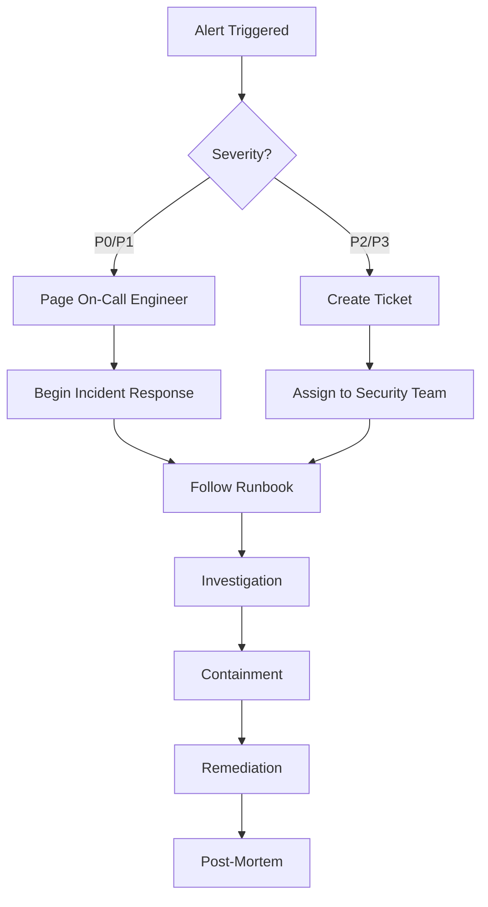

# Security Monitoring Guide

> Production security event monitoring, alerting, and investigation procedures for goimg-datalayer

## Overview

This document defines the security monitoring strategy for detecting, alerting on, and investigating security events in the goimg-datalayer platform. Effective security monitoring provides early warning of attacks, compliance evidence, and forensic data for incident response.

**Document Owner**: Security Operations Team
**Last Updated**: 2025-12-05
**Review Frequency**: Quarterly

---

## Security Events to Monitor

### Authentication Events

#### Failed Login Attempts

**Event**: User authentication failures at `/api/v1/auth/login`

**Detection Logic**:
```promql
# Prometheus query
rate(http_auth_failures_total{endpoint="/api/v1/auth/login"}[5m]) > 0.33
```

**Alert Thresholds**:
- **Warning**: >10 failures/minute from single IP
- **Critical**: >50 failures/minute from single IP OR >100 failures/minute globally

**Response Procedure**:
1. **Warning Level**:
   - Verify IP reputation (VPN, proxy, known attacker)
   - Check if legitimate user with password issues
   - Monitor for escalation (increase to 20/min = credential stuffing)

2. **Critical Level**:
   - Immediately block source IP via iptables/WAF
   - Enable CAPTCHA on login endpoint
   - Notify security team via PagerDuty
   - Begin incident response (see `incident_response.md`)

**Investigation**:
```bash
# View failed login attempts by IP
grep "authentication_failed" /var/log/goimg-api/app.log | \
  jq -r '[.timestamp, .client_ip, .username] | @tsv' | \
  sort | uniq -c | sort -rn | head -20

# Check if usernames are valid (enumeration vs credential stuffing)
grep "authentication_failed" /var/log/goimg-api/app.log | \
  jq -r .username | sort | uniq -c | sort -rn

# Analyze time distribution (human vs bot)
grep "authentication_failed" /var/log/goimg-api/app.log | \
  jq -r .timestamp | cut -d'T' -f2 | cut -d':' -f1-2 | \
  sort | uniq -c
```

**Log Format**:
```json
{
  "timestamp": "2025-12-05T14:32:18.123Z",
  "level": "warn",
  "event": "authentication_failed",
  "client_ip": "203.0.113.42",
  "username": "admin",
  "reason": "invalid_credentials",
  "user_agent": "Mozilla/5.0...",
  "request_id": "req-abc123"
}
```

---

#### Successful Login Anomalies

**Event**: Legitimate authentication with unusual characteristics

**Detection Patterns**:
1. **Geographic Anomaly**: Login from different country within 1 hour
2. **Time Anomaly**: Login outside user's normal hours (e.g., 3 AM local time)
3. **Device Anomaly**: New device/browser for existing user
4. **Velocity Anomaly**: Multiple logins from different IPs in short time

**Alert Thresholds**:
- **Info**: New device for existing user (notify user via email)
- **Warning**: Login from new country (notify user, consider step-up auth)
- **Critical**: Impossible travel (e.g., USA → China in 10 minutes)

**Response Procedure**:
1. **Info/Warning**:
   - Send notification email to user: "New login from [location]"
   - Provide "This wasn't me" link to lock account
   - Log event for pattern analysis

2. **Critical**:
   - Immediately revoke all user sessions
   - Force password reset
   - Notify user via all channels (email, SMS if available)
   - Begin fraud investigation

**Investigation**:
```sql
-- Find impossible travel patterns
WITH login_events AS (
  SELECT
    user_id,
    client_ip,
    timestamp,
    LAG(timestamp) OVER (PARTITION BY user_id ORDER BY timestamp) AS prev_timestamp,
    LAG(client_ip) OVER (PARTITION BY user_id ORDER BY timestamp) AS prev_ip
  FROM audit_log
  WHERE event_type = 'user_login'
  AND timestamp > NOW() - INTERVAL '24 hours'
)
SELECT *
FROM login_events
WHERE prev_timestamp IS NOT NULL
  AND client_ip != prev_ip
  AND (timestamp - prev_timestamp) < INTERVAL '1 hour';
```

---

#### Session Anomalies

**Event**: Suspicious session behavior post-authentication

**Detection Patterns**:
1. **Session Hijacking**: IP/User-Agent change during active session
2. **Token Replay**: Refresh token used from multiple IPs simultaneously
3. **Privilege Escalation**: User role changes during session
4. **Session Fixation**: Session ID reused after logout

**Alert Thresholds**:
- **Critical**: Any session hijacking or replay detection

**Response Procedure**:
```bash
# Automatically revoke suspicious session
curl -X DELETE https://api.goimg.example.com/admin/v1/sessions/{session_id} \
  -H "Authorization: Bearer $ADMIN_TOKEN" \
  -H "X-Security-Event: session_anomaly_detected"

# Blacklist entire token family
redis-cli SADD "goimg:blacklist:families" "family-uuid-123"

# Notify user
curl -X POST https://api.goimg.example.com/admin/v1/notifications \
  -H "Content-Type: application/json" \
  -d '{
    "user_id": "user-uuid",
    "type": "security_alert",
    "message": "Suspicious session activity detected. All sessions have been logged out for your security."
  }'
```

**Log Format**:
```json
{
  "timestamp": "2025-12-05T14:45:32.456Z",
  "level": "critical",
  "event": "session_anomaly",
  "anomaly_type": "ip_change",
  "user_id": "550e8400-e29b-41d4-a716-446655440000",
  "session_id": "sess-abc123",
  "original_ip": "192.0.2.10",
  "new_ip": "203.0.113.42",
  "action_taken": "session_revoked"
}
```

---

### Authorization Events

#### Privilege Escalation Attempts

**Event**: User attempting to access resources beyond their role

**Detection Examples**:
- Regular user accessing `/api/v1/admin/*` endpoints
- User accessing `/api/v1/users/{other_user_id}/private-images`
- Moderator attempting `/api/v1/admin/system-config` (admin-only)

**Alert Thresholds**:
- **Warning**: Single unauthorized access attempt (could be legitimate mistake)
- **Critical**: >3 unauthorized attempts in 5 minutes (deliberate attack)

**Response Procedure**:
1. **Warning**:
   - Log event with full context (user, resource, timestamp)
   - Monitor for repeat attempts
   - No immediate action (allow for UI bugs, legitimate errors)

2. **Critical**:
   - Temporarily suspend user account (status = 'suspended')
   - Notify security team for manual review
   - Analyze user's recent activity for compromise indicators
   - Consider forced password reset if account compromise suspected

**Investigation**:
```bash
# Find privilege escalation patterns
grep "authorization_failed" /var/log/goimg-api/app.log | \
  jq -r 'select(.reason == "insufficient_privileges") |
    [.timestamp, .user_id, .endpoint, .required_role, .user_role] | @tsv' | \
  awk '{print $2}' | sort | uniq -c | sort -rn

# Check if specific user has escalation attempts
jq -r 'select(.user_id == "suspicious-user-id" and .event == "authorization_failed") |
  [.timestamp, .endpoint, .required_role]' /var/log/goimg-api/app.log
```

**Log Format**:
```json
{
  "timestamp": "2025-12-05T15:12:44.789Z",
  "level": "warn",
  "event": "authorization_failed",
  "user_id": "550e8400-e29b-41d4-a716-446655440000",
  "user_role": "user",
  "endpoint": "/api/v1/admin/users",
  "method": "GET",
  "required_role": "admin",
  "reason": "insufficient_privileges",
  "client_ip": "203.0.113.42"
}
```

---

#### IDOR (Insecure Direct Object Reference) Attempts

**Event**: User accessing another user's resources via ID manipulation

**Detection**:
- User requesting `/api/v1/images/{image_id}` for image they don't own (when image is private)
- User modifying `/api/v1/users/{other_user_id}/profile`
- User deleting `/api/v1/albums/{album_id}` not belonging to them

**Alert Thresholds**:
- **Warning**: Single IDOR attempt (could be shared link confusion)
- **Critical**: >5 IDOR attempts in 10 minutes (scanning attack)

**Response Procedure**:
1. **Critical**:
   - Rate-limit user's API access (1 request/second for 1 hour)
   - Flag account for security review
   - Analyze if any successful unauthorized access occurred
   - If successful access found, trigger incident response

**Investigation**:
```sql
-- Find users attempting to access others' resources
SELECT
  user_id,
  COUNT(*) AS idor_attempts,
  ARRAY_AGG(DISTINCT target_resource_id) AS attempted_resources
FROM audit_log
WHERE event_type = 'authorization_failed'
  AND reason = 'resource_not_owned'
  AND timestamp > NOW() - INTERVAL '1 hour'
GROUP BY user_id
HAVING COUNT(*) > 5
ORDER BY idor_attempts DESC;
```

---

### Rate Limiting Events

#### Rate Limit Violations

**Event**: User or IP exceeding configured rate limits

**Rate Limit Tiers**:
| Endpoint Pattern | Limit | Window | Severity if Exceeded |
|------------------|-------|--------|---------------------|
| `/api/v1/auth/login` | 5 requests | 1 minute | Critical |
| `/api/v1/auth/register` | 3 requests | 10 minutes | Critical |
| `/api/v1/images` (upload) | 50 requests | 1 hour | High |
| `/api/v1/images` (read) | 1000 requests | 1 minute | Medium |
| `/api/v1/*` (global) | 100 requests | 1 minute | Medium |

**Alert Thresholds**:
- **Warning**: Rate limit hit 3 times in 5 minutes
- **Critical**: Rate limit hit >100 times in 5 minutes (bot/scraper)

**Response Procedure**:
1. **Warning**:
   - Identify if legitimate user (mobile app bug, overzealous cron)
   - Contact user if known account
   - Increase rate limit temporarily if legitimate use case

2. **Critical**:
   - Block IP via iptables for 1 hour
   - Add to WAF blocklist
   - Analyze traffic pattern (DDoS, scraping, credential stuffing)
   - Consider permanent ban if malicious intent confirmed

**Investigation**:
```bash
# View rate limit violations by IP
redis-cli --scan --pattern "goimg:ratelimit:violations:*" | \
  while read key; do
    echo "$key: $(redis-cli GET $key)"
  done | sort -t':' -k4 -rn | head -20

# Check specific IP's request pattern
grep "203.0.113.42" /var/log/nginx/access.log | \
  awk '{print $7}' | sort | uniq -c | sort -rn
```

**Log Format**:
```json
{
  "timestamp": "2025-12-05T16:20:15.321Z",
  "level": "warn",
  "event": "rate_limit_exceeded",
  "client_ip": "203.0.113.42",
  "endpoint": "/api/v1/auth/login",
  "limit": "5/minute",
  "current_count": 23,
  "window_start": "2025-12-05T16:20:00Z",
  "action": "request_rejected"
}
```

---

### Malware Detection Events

#### ClamAV Malware Detection

**Event**: ClamAV detects malware in uploaded image

**Detection**: Any malware detection is critical

**Alert Thresholds**:
- **Critical**: Any single malware detection

**Response Procedure**:
1. **Immediate**:
   - Upload automatically rejected by validation pipeline
   - File quarantined (moved to isolated storage, not deleted)
   - User account flagged for review

2. **Investigation** (within 1 hour):
   ```bash
   # Retrieve quarantined file metadata
   aws s3 ls s3://goimg-quarantine/$(date +%Y-%m-%d)/ --recursive

   # Get detailed scan report
   grep "malware_detected" /var/log/goimg-api/app.log | \
     jq -r 'select(.file_hash == "sha256-abc123") |
       [.timestamp, .user_id, .virus_name, .file_size]'

   # Check if user has other uploads
   psql -h $DB_HOST -U $DB_USER -d goimg <<SQL
   SELECT id, filename, uploaded_at, status
   FROM images
   WHERE user_id = (
     SELECT user_id FROM images WHERE file_hash = 'sha256-abc123'
   )
   ORDER BY uploaded_at DESC;
   SQL
   ```

3. **User Action**:
   - Send notification explaining malware detection
   - Suspend account if multiple malware uploads (likely compromised)
   - Require password reset before re-enabling account

4. **Threat Intelligence**:
   - Submit file hash to VirusTotal for secondary analysis
   - Share IOCs with security community if novel malware
   - Update ClamAV signatures if false positive

**Log Format**:
```json
{
  "timestamp": "2025-12-05T17:05:42.654Z",
  "level": "critical",
  "event": "malware_detected",
  "user_id": "550e8400-e29b-41d4-a716-446655440000",
  "file_hash": "sha256:a1b2c3d4...",
  "file_size": 2457600,
  "virus_name": "Win.Trojan.Generic-12345",
  "scan_timestamp": "2025-12-05T17:05:41.123Z",
  "quarantine_path": "s3://goimg-quarantine/2025-12-05/a1b2c3d4.bin",
  "action_taken": "upload_rejected"
}
```

**Monitoring Query**:
```promql
# Prometheus alert
sum(increase(clamav_malware_detections_total[5m])) > 0
```

---

#### Image Validation Failures

**Event**: Image fails validation beyond malware (polyglot, size, format)

**Detection Patterns**:
- Polyglot file (valid image + embedded executable)
- File size exceeds limit (>50MB)
- Invalid image format (corrupted headers)
- EXIF metadata injection attempts

**Alert Thresholds**:
- **Info**: Single validation failure (user error)
- **Warning**: >10 validation failures from single user in 1 hour (testing defenses)
- **Critical**: Polyglot file detected (sophisticated attack)

**Response Procedure**:
1. **Polyglot Detection** (Critical):
   - Quarantine file immediately
   - Flag user account
   - Analyze file with forensic tools
   - Report to security research community

**Investigation**:
```bash
# Check for polyglot patterns
file /tmp/suspicious-upload.jpg
# Expected: "JPEG image data"
# Suspicious: "JPEG image data, with embedded PE executable"

# Examine file header
xxd /tmp/suspicious-upload.jpg | head -20

# Check for embedded scripts
strings /tmp/suspicious-upload.jpg | grep -i "eval\|exec\|script"
```

---

### Data Access Events

#### Bulk Data Export

**Event**: User downloading large numbers of images in short time

**Detection**:
```sql
SELECT user_id, COUNT(*) as download_count
FROM image_downloads
WHERE downloaded_at > NOW() - INTERVAL '1 hour'
GROUP BY user_id
HAVING COUNT(*) > 100;
```

**Alert Thresholds**:
- **Warning**: >100 downloads in 1 hour
- **Critical**: >500 downloads in 1 hour (data exfiltration)

**Response Procedure**:
1. **Warning**:
   - Verify if legitimate use (user backing up their own data)
   - Check if downloads are user's own images vs others' public images
   - Rate-limit downloads if scraping behavior detected

2. **Critical**:
   - Immediately revoke user's access tokens
   - Analyze downloaded images (own vs others, public vs private)
   - If unauthorized access, trigger incident response
   - Contact user to verify legitimate activity

---

#### Database Access Patterns

**Event**: Unusual database queries or access patterns

**Detection**:
- Slow queries (>5 seconds) indicating full table scans
- High number of queries from single connection
- Access to sensitive tables outside normal application flow
- Database errors indicating SQL injection attempts

**Alert Thresholds**:
- **Warning**: >10 slow queries per hour
- **Critical**: SQL syntax errors with unusual patterns (quotes, semicolons in user input)

**Response Procedure**:
```bash
# Monitor PostgreSQL slow queries
tail -f /var/log/postgresql/postgresql.log | grep "duration:"

# Check for SQL injection patterns
grep -E "syntax error.*'|--|\bunion\b|\bselect\b.*\bfrom\b.*\bwhere\b" \
  /var/log/postgresql/postgresql.log

# Analyze query patterns
psql -h $DB_HOST -U $DB_USER -d goimg <<SQL
SELECT
  usename,
  application_name,
  COUNT(*) as query_count,
  MAX(state_change) as last_query
FROM pg_stat_activity
WHERE state != 'idle'
GROUP BY usename, application_name
ORDER BY query_count DESC;
SQL
```

---

## Alert Configuration

### Prometheus Alert Rules

**File**: `/home/user/goimg-datalayer/deployments/prometheus/rules/security.yml`

```yaml
groups:
  - name: security_alerts
    interval: 30s
    rules:
      # Authentication failures
      - alert: HighAuthenticationFailureRate
        expr: rate(http_auth_failures_total[5m]) > 0.33
        for: 2m
        labels:
          severity: critical
          team: security
        annotations:
          summary: "High authentication failure rate detected"
          description: "{{ $value }} auth failures/sec from {{ $labels.client_ip }}"
          runbook: "https://docs.goimg.example.com/security/monitoring#failed-login-attempts"

      # Rate limit violations
      - alert: RateLimitViolations
        expr: increase(rate_limit_exceeded_total[5m]) > 100
        for: 1m
        labels:
          severity: critical
          team: security
        annotations:
          summary: "Excessive rate limit violations"
          description: "{{ $value }} rate limit violations in 5 minutes"
          runbook: "https://docs.goimg.example.com/security/monitoring#rate-limit-violations"

      # Malware detections
      - alert: MalwareDetected
        expr: increase(clamav_malware_detections_total[5m]) > 0
        for: 0m
        labels:
          severity: critical
          team: security
        annotations:
          summary: "Malware detected in upload"
          description: "ClamAV detected {{ $value }} malware samples"
          runbook: "https://docs.goimg.example.com/security/monitoring#malware-detection"

      # Privilege escalation attempts
      - alert: PrivilegeEscalationAttempts
        expr: increase(authorization_failures_total{reason="insufficient_privileges"}[10m]) > 3
        for: 1m
        labels:
          severity: warning
          team: security
        annotations:
          summary: "Multiple privilege escalation attempts"
          description: "{{ $labels.user_id }} attempted unauthorized access {{ $value }} times"
          runbook: "https://docs.goimg.example.com/security/monitoring#privilege-escalation"

      # Session anomalies
      - alert: SessionAnomalyDetected
        expr: increase(session_anomalies_total[5m]) > 0
        for: 0m
        labels:
          severity: critical
          team: security
        annotations:
          summary: "Session hijacking or replay attack detected"
          description: "Anomaly type: {{ $labels.anomaly_type }}"
          runbook: "https://docs.goimg.example.com/security/monitoring#session-anomalies"

      # JWT signature failures
      - alert: JWTValidationFailures
        expr: rate(jwt_validation_failures_total[5m]) > 0.1
        for: 2m
        labels:
          severity: warning
          team: security
        annotations:
          summary: "High rate of JWT validation failures"
          description: "{{ $value }} JWT failures/sec - possible token tampering"
          runbook: "https://docs.goimg.example.com/security/monitoring#jwt-validation"
```

---

## Log Investigation Guide

### Structured Logging Format

All security events are logged in structured JSON format using zerolog:

```json
{
  "timestamp": "2025-12-05T14:32:18.123456Z",
  "level": "warn|error|critical",
  "event": "event_name",
  "user_id": "uuid",
  "session_id": "uuid",
  "client_ip": "ipv4_address",
  "user_agent": "browser_string",
  "endpoint": "/api/v1/resource",
  "method": "GET|POST|PUT|DELETE",
  "request_id": "unique_request_id",
  "context": {
    "additional": "metadata"
  }
}
```

### Common Investigation Queries

#### Find All Actions by User
```bash
grep "\"user_id\":\"550e8400-e29b-41d4-a716-446655440000\"" \
  /var/log/goimg-api/app.log | \
  jq -r '[.timestamp, .event, .endpoint, .client_ip] | @tsv' | \
  sort
```

#### Trace Single Request
```bash
REQUEST_ID="req-abc123"
grep "\"request_id\":\"$REQUEST_ID\"" /var/log/goimg-api/app.log | jq
```

#### Find Failed Operations
```bash
jq -r 'select(.level == "error" or .level == "critical") |
  [.timestamp, .event, .user_id, .error] | @tsv' \
  /var/log/goimg-api/app.log | tail -100
```

#### Analyze IP Reputation
```bash
IP="203.0.113.42"

# Count events from IP
grep "\"client_ip\":\"$IP\"" /var/log/goimg-api/app.log | wc -l

# Breakdown by event type
grep "\"client_ip\":\"$IP\"" /var/log/goimg-api/app.log | \
  jq -r .event | sort | uniq -c | sort -rn

# Check if IP is in known malicious database
curl -s "https://api.abuseipdb.com/api/v2/check?ipAddress=$IP" \
  -H "Key: $ABUSEIPDB_API_KEY" \
  -H "Accept: application/json" | jq
```

#### Session Timeline Reconstruction
```bash
SESSION_ID="sess-xyz789"

grep "\"session_id\":\"$SESSION_ID\"" /var/log/goimg-api/app.log | \
  jq -r '[.timestamp, .event, .client_ip, .endpoint] | @tsv' | \
  sort
```

---

## Audit Log Format and Retention

### Audit Log Table Schema

```sql
CREATE TABLE audit_log (
    id BIGSERIAL PRIMARY KEY,
    timestamp TIMESTAMP NOT NULL DEFAULT NOW(),
    event_type VARCHAR(50) NOT NULL,
    user_id UUID,
    session_id UUID,
    client_ip INET,
    user_agent TEXT,
    endpoint VARCHAR(255),
    http_method VARCHAR(10),
    status_code INT,
    request_id VARCHAR(100),
    metadata JSONB,
    INDEX idx_audit_timestamp (timestamp),
    INDEX idx_audit_user_id (user_id, timestamp),
    INDEX idx_audit_event_type (event_type, timestamp),
    INDEX idx_audit_client_ip (client_ip, timestamp)
);

-- Partition by month for efficient retention management
CREATE TABLE audit_log_2025_12 PARTITION OF audit_log
    FOR VALUES FROM ('2025-12-01') TO ('2026-01-01');
```

### Retention Policy

| Log Type | Retention Period | Storage | Rationale |
|----------|------------------|---------|-----------|
| **Security Events** (auth failures, malware, escalation) | 90 days (hot) + 7 years (cold) | PostgreSQL + S3 Glacier | Compliance, forensics |
| **Audit Logs** (all user actions) | 90 days (hot) + 1 year (cold) | PostgreSQL + S3 | Investigation, compliance |
| **Application Logs** | 30 days | Elasticsearch | Debugging, monitoring |
| **Access Logs** (nginx) | 30 days | Local disk | Performance, debugging |
| **Forensic Snapshots** | 7 years | S3 Glacier (encrypted) | Legal hold, incident evidence |

### Automated Retention Management

```bash
#!/bin/bash
# /home/user/goimg-datalayer/scripts/audit_log_retention.sh

# Archive security events older than 90 days to S3
psql -h $DB_HOST -U $DB_USER -d goimg <<SQL
COPY (
  SELECT * FROM audit_log
  WHERE timestamp < NOW() - INTERVAL '90 days'
  AND event_type IN ('authentication_failed', 'malware_detected', 'authorization_failed')
) TO STDOUT (FORMAT CSV, HEADER)
SQL | gzip | aws s3 cp - s3://goimg-audit-archive/security-events-$(date +%Y%m).csv.gz

# Delete archived records
psql -h $DB_HOST -U $DB_USER -d goimg <<SQL
DELETE FROM audit_log
WHERE timestamp < NOW() - INTERVAL '90 days'
AND event_type IN ('authentication_failed', 'malware_detected', 'authorization_failed');
SQL

# Archive general audit logs older than 90 days
psql -h $DB_HOST -U $DB_USER -d goimg <<SQL
DELETE FROM audit_log
WHERE timestamp < NOW() - INTERVAL '90 days'
AND event_type NOT IN ('authentication_failed', 'malware_detected', 'authorization_failed');
SQL
```

**Cron Schedule**:
```cron
# Run daily at 2 AM
0 2 * * * /home/user/goimg-datalayer/scripts/audit_log_retention.sh
```

---

## Security Metrics Dashboard

### Key Metrics to Track

```promql
# Authentication metrics
rate(http_auth_attempts_total[5m])
rate(http_auth_failures_total[5m])
http_auth_failures_total / http_auth_attempts_total  # Failure rate

# Authorization metrics
rate(authorization_failures_total[5m])
authorization_failures_total{reason="insufficient_privileges"}

# Rate limiting metrics
rate(rate_limit_exceeded_total[5m])
rate_limit_exceeded_total by (endpoint)

# Malware detection metrics
clamav_malware_detections_total
clamav_scan_latency_seconds

# Session metrics
session_anomalies_total by (anomaly_type)
active_sessions_total by (user_role)

# JWT metrics
jwt_validation_failures_total by (failure_reason)
jwt_generation_latency_seconds
```

### Grafana Dashboard Template

**Dashboard**: Security Operations Dashboard

**Panels**:
1. **Authentication Overview** (Row 1)
   - Login attempts per minute (graph)
   - Login failure rate (gauge)
   - Top failed usernames (table)
   - Failed logins by IP (heatmap)

2. **Authorization Events** (Row 2)
   - Privilege escalation attempts (counter)
   - IDOR attempts (graph)
   - Authorization failures by endpoint (bar chart)

3. **Malware Detection** (Row 3)
   - Malware detections (counter, critical alert if >0)
   - Virus names detected (table)
   - Scan latency (histogram)

4. **Rate Limiting** (Row 4)
   - Rate limit violations per endpoint (stacked graph)
   - Top IPs violating limits (table)

5. **Session Security** (Row 5)
   - Session anomalies (counter)
   - Anomaly types breakdown (pie chart)
   - Active sessions by role (gauge)

---

## Incident Response Integration

When monitoring alerts trigger, follow escalation paths defined in `/home/user/goimg-datalayer/docs/security/incident_response.md`:



---

## Compliance and Audit

### SOC 2 Control Mapping

| Control | Monitoring Activity |
|---------|---------------------|
| **CC6.1** (Logical Access) | Authentication failure monitoring, session anomaly detection |
| **CC6.2** (Transmission Integrity) | TLS certificate expiry monitoring, encryption validation |
| **CC6.6** (Unauthorized Access) | Authorization failure tracking, privilege escalation detection |
| **CC6.7** (Malicious Software) | ClamAV malware scanning, quarantine logging |
| **CC7.2** (System Monitoring) | All security event monitoring, alert response SLAs |
| **CC7.3** (Incident Response) | Incident ticket creation, timeline documentation |

### GDPR Article 32 (Security)

**Technical Measures**:
- Continuous monitoring of authentication and authorization
- Malware detection to prevent data corruption
- Audit logging for data access accountability
- Incident response procedures for personal data breaches

**Breach Notification**:
If monitoring detects personal data breach:
1. Document breach within 24 hours
2. Assess scope (number of data subjects, data types)
3. Notify supervisory authority within 72 hours (GDPR Article 33)
4. Notify affected users if high risk (GDPR Article 34)

---

## Tools and Integrations

### Current Stack

- **Logging**: zerolog (structured JSON)
- **Metrics**: Prometheus
- **Visualization**: Grafana
- **Alerting**: Prometheus Alertmanager → PagerDuty
- **Log Aggregation**: Local files (planned: Elasticsearch/Loki)
- **SIEM**: Planned (Sprint 10+)

### Future Enhancements

1. **SIEM Integration** (Wazuh, Splunk, ELK)
   - Correlation rules for multi-stage attacks
   - Threat intelligence feed integration
   - Automated response playbooks

2. **User Behavior Analytics (UBA)**
   - Machine learning for anomaly detection
   - Baseline user behavior profiles
   - Risk scoring for users and sessions

3. **SOAR (Security Orchestration)**
   - Automated containment actions
   - Integration with WAF/firewall for IP blocking
   - Automated user notification

---

## Runbook Maintenance

### Quarterly Review Checklist

```markdown
- [ ] Verify alert thresholds still appropriate (adjust for scale)
- [ ] Test alert routing (PagerDuty, email, Slack)
- [ ] Review false positive rate (tune detection logic)
- [ ] Update log retention policy for compliance changes
- [ ] Validate monitoring coverage for new features
- [ ] Test incident response integration (tabletop exercise)
- [ ] Update documentation for tool changes
- [ ] Train new team members on runbook procedures
```

---

## Document Control

**Version History**:
- v1.0 (2025-12-05): Initial creation for Sprint 9

**Related Documents**:
- `/home/user/goimg-datalayer/SECURITY.md` - Vulnerability disclosure policy
- `/home/user/goimg-datalayer/docs/security/incident_response.md` - Incident response procedures
- `/home/user/goimg-datalayer/docs/security/secret_rotation.md` - Secret rotation procedures
- `/home/user/goimg-datalayer/claude/security_gates.md` - Security gate requirements

**Approval**:
- Security Operations Lead: [Pending]
- Engineering Director: [Pending]
- Compliance Officer: [Pending]
